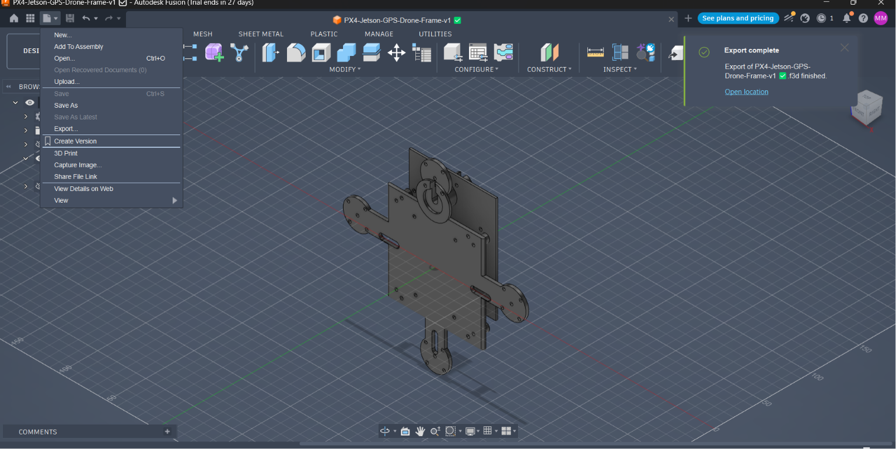

# PX4-Jetson-GPS-Drone

An autonomous GPS navigation drone project using Pixhawk, PX4, QGroundControl and NVIDIA Jetson.

## Project Overview

The goal of this project is to design, build and test a quadcopter capable of safe GPS-assisted flight. The project will begin with simulation and basic flight control before progressing to Jetson-based autonomous functions.
## System Architecture

The diagram below shows the high-level architecture of the autonomous drone system, integrating PX4, Pixhawk, GPS, QGroundControl and NVIDIA Jetson.


## Main Objectives

- Build and configure a quadcopter using Pixhawk
- Install and configure PX4 firmware
- Display the drone's live GPS position
- Create supervised waypoint missions
- Implement Return-to-Home functionality
- Connect NVIDIA Jetson to Pixhawk
- Test the system safely through simulation and real flights
- Document the design, code, tests and results

## Planned Features

- GPS position monitoring
- Stable manual and assisted flight
- Supervised waypoint navigation
- Return-to-Home
- Automatic landing and flight safety settings
- Pixhawk–Jetson communication using MAVLink/MAVSDK
- Future computer-vision capability

## Hardware

- Quadcopter frame
- Pixhawk flight controller
- GPS and compass module
- NVIDIA Jetson companion computer
- Brushless motors
- Electronic Speed Controllers (ESCs)
- Propellers
- Power module and LiPo battery
- Radio transmitter and receiver
- Telemetry module

The final hardware models will be documented after component selection.

## Software

- PX4 Autopilot
- QGroundControl
- NVIDIA JetPack
- Python
- MAVSDK
- MAVLink
- Fusion 360
- PX4 Simulation

## Project Stages

### Stage 1 — Planning and Simulation

- Define system requirements
- Design the drone structure
- Prepare the development environment
- Run PX4 simulation
- Practise waypoint and Return-to-Home missions

### Stage 2 — Assembly and Configuration

- Assemble the drone
- Install the flight controller and GPS
- Complete wiring
- Configure and calibrate PX4
- Perform safety checks

### Stage 3 — Flight Testing

- Motor test without propellers
- Controlled hover test
- GPS position test
- Waypoint mission test
- Return-to-Home test
- Record and analyse results

### Stage 4 — Jetson Integration

- Connect NVIDIA Jetson to Pixhawk
- Read flight telemetry
- Send supervised commands using MAVSDK
- Develop future intelligent navigation features

## Repository Structure

```text
PX4-Jetson-GPS-Drone/
├── docs/
├── hardware/
├── images/
├── missions/
├── simulation/
├── software/
└── test-results/
```

## Safety

All initial software tests will be conducted in simulation. Hardware tests will begin without propellers. Outdoor flight tests will be performed in a safe permitted area after completing calibration and pre-flight checks.

## Current Status

Project initiated. Repository structure, system planning and simulation setup are in progress.

## CAD Design & Technical Drawings

The drone frame was designed and documented using Autodesk Fusion 360.

The CAD documentation includes:
- Fusion 360 source model (.f3d)
- STL model for fabrication and 3D printing
- Engineering technical drawing with dimensions
- 3D model visualization

### 3D Frame Model



### CAD Files

[View CAD Files](hardware/cad/)

### Technical Drawing

[View Technical Drawing](hardware/technical-drawings/)
## Author

**Mohamed Daud Abdillahi**  
Metallurgy and Materials Engineering Student  
Karabük University

## License

This project is licensed under the MIT License.
