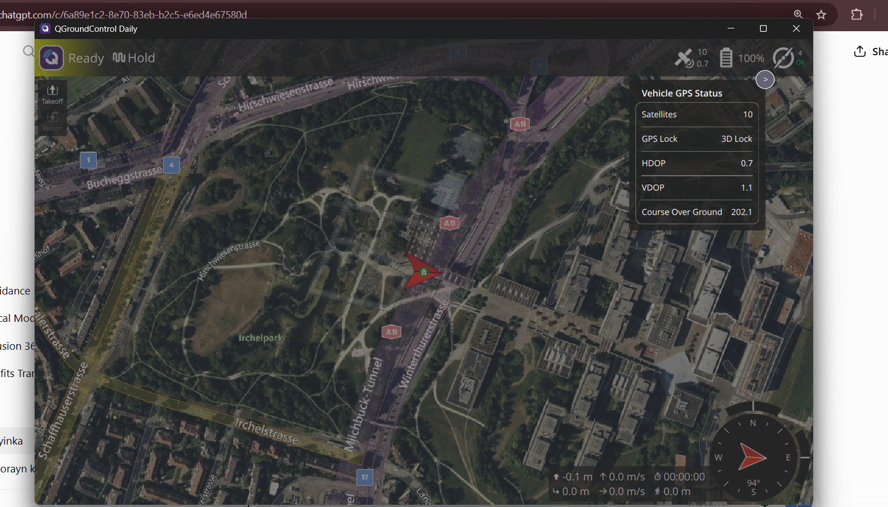
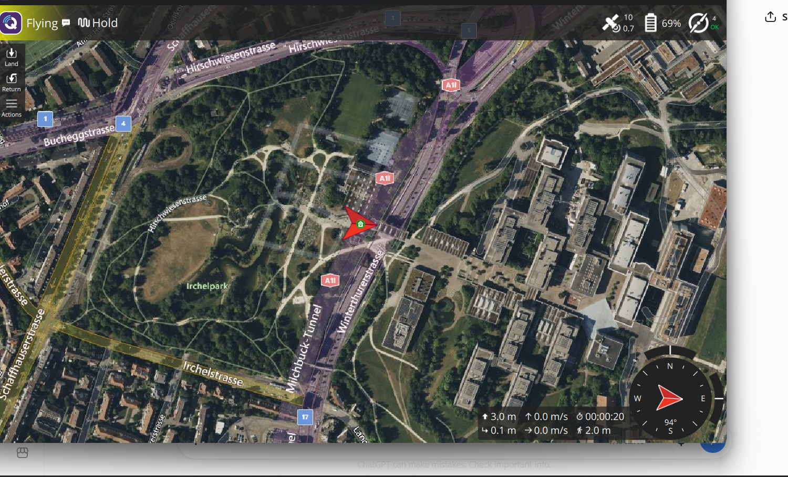
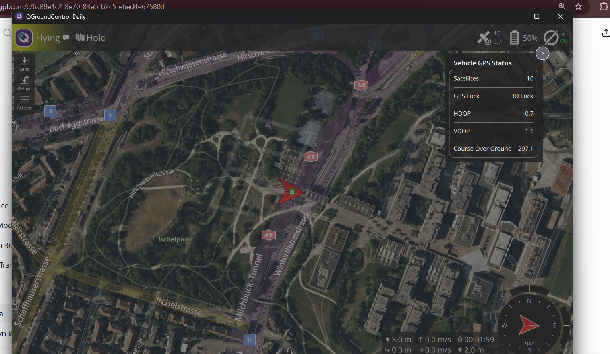
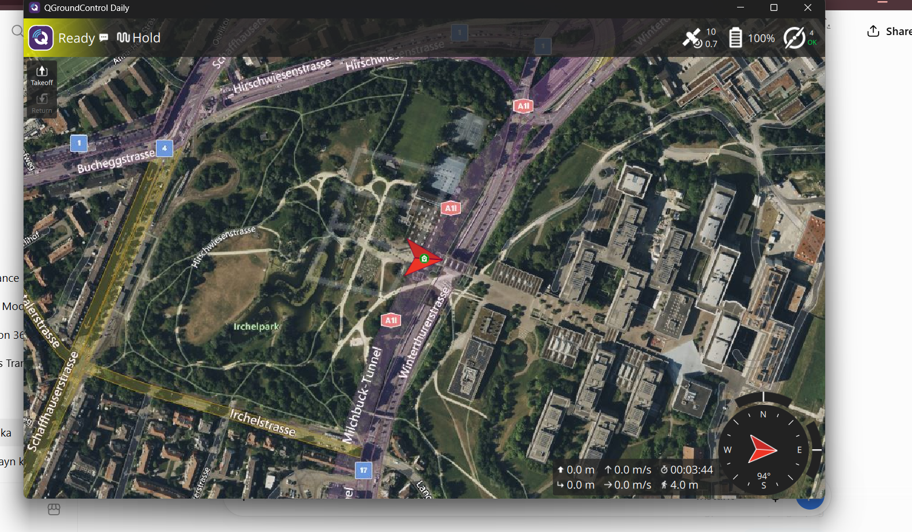

# TEST-004 — GPS Position and Telemetry Monitoring

## Test Summary

| Item | Result |
|---|---|
| Test ID | TEST-004 |
| Environment | PX4 Software-in-the-Loop (SITL) |
| Vehicle | Gazebo x500 Quadcopter |
| Ground Station | QGroundControl Daily |
| Test Result | **PASS** |

## Objective

The objective of this test was to verify that the simulated PX4 x500 quadcopter could provide reliable GPS position and flight telemetry through QGroundControl.

The test focused on:

- GPS satellite availability
- GPS lock status
- GPS position monitoring
- Altitude telemetry
- Flight-state monitoring
- GPS monitoring during flight
- Safe landing and recovery

## Test Configuration

- Operating System: Windows 11
- Linux Environment: Ubuntu 22.04 on WSL2
- Autopilot: PX4 SITL
- Simulator: Gazebo Harmonic
- Vehicle Model: x500 Quadcopter
- Ground Control Station: QGroundControl Daily
- Communication: MAVLink over UDP

## Test Procedure

1. Started PX4 SITL with the Gazebo x500 quadcopter.
2. Connected QGroundControl to the simulated vehicle.
3. Confirmed that the vehicle status displayed Ready.
4. Verified GPS satellite availability.
5. Confirmed a 3D GPS Lock.
6. Observed 10 GPS satellites.
7. Verified HDOP of approximately 0.7.
8. Commanded the vehicle to take off to approximately 3 metres.
9. Maintained the vehicle in Hold mode.
10. Monitored GPS and flight telemetry while airborne.
11. Confirmed an altitude of approximately 3.0 metres.
12. Verified that GPS lock remained stable during flight.
13. Commanded the vehicle to land.
14. Confirmed safe landing and return to Ready state.

## Results

The test was completed successfully.

Observed GPS data included:

- Satellites: 10
- GPS Lock: 3D Lock
- HDOP: 0.7
- VDOP: 1.1
- Flight altitude: approximately 3.0 m
- Vehicle state during test: Flying / Hold
- Final state: Ready
- Final altitude: 0.0 m

The GPS connection remained stable during the flight and telemetry information was successfully displayed through QGroundControl.

## Flight Evidence

Evidence captured during TEST-004 includes:

1. GPS status before takeoff.
2. Vehicle hovering at approximately 3 metres.
3. GPS telemetry while the vehicle was airborne.
4. Safe landing and return to Ready state.
### 1. GPS Status Before Takeoff

### 2. Vehicle Hovering at Approximately 3 Metres

### 3. GPS Telemetry During Flight

### 4. Safe Landing and Return to Ready State

## Conclusion

**TEST-004 PASSED.**

The PX4 SITL x500 quadcopter successfully maintained GPS positioning and transmitted flight telemetry to QGroundControl during takeoff, hover and landing.

This test confirms that the simulated GPS and telemetry system is operational and provides a foundation for future autonomous navigation and companion-computer integration.
