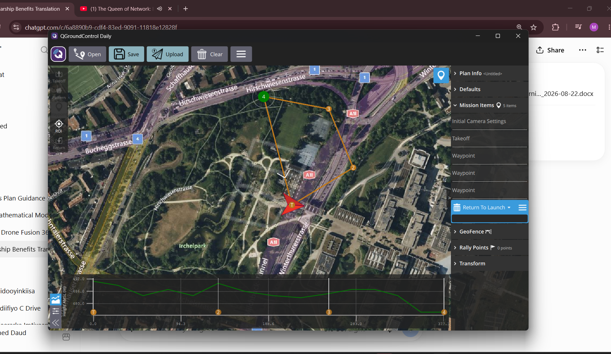
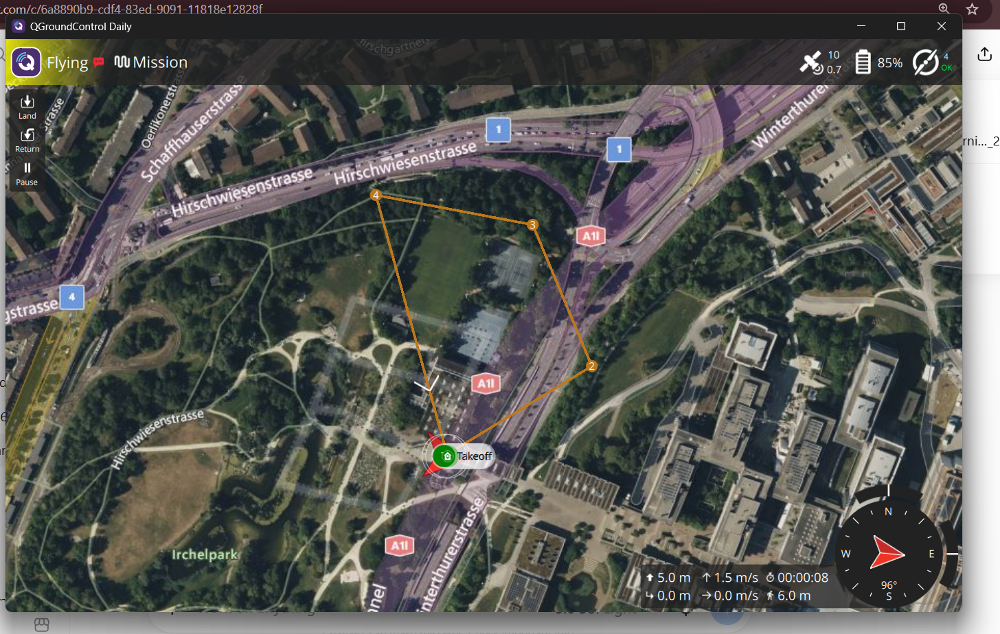
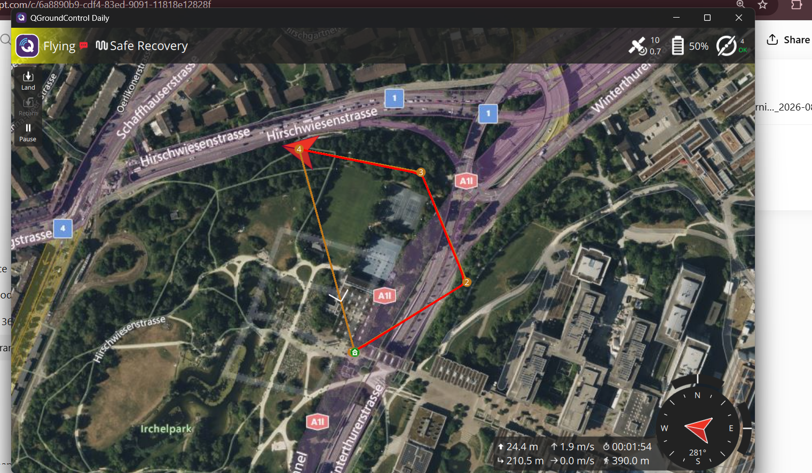
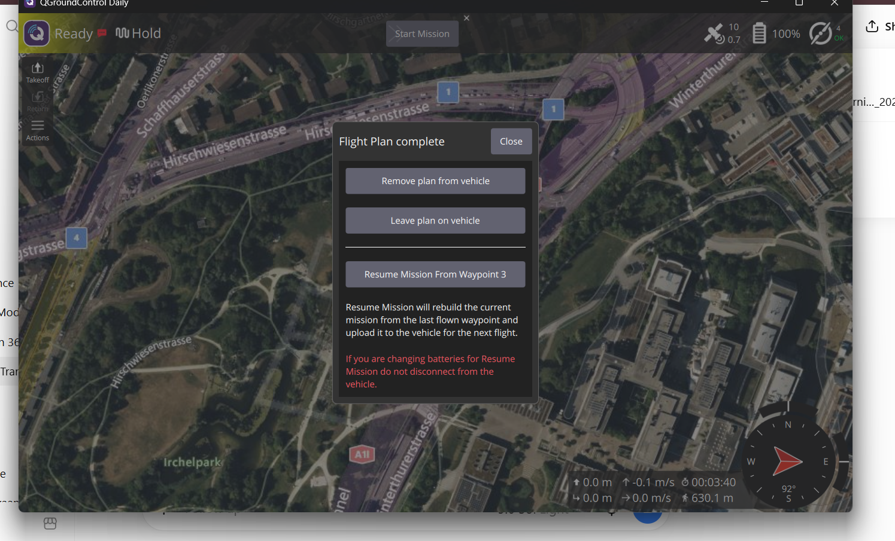

# TEST-002 — Supervised GPS Waypoint Mission

## Test Summary

| Item | Result |
|---|---|
| Test ID | TEST-002 |
| Date | 22 August 2026 |
| Environment | PX4 Software-in-the-Loop (SITL) |
| Simulator | Gazebo Sim |
| Vehicle | Gazebo x500 Quadcopter |
| Ground Station | QGroundControl Daily |
| Mission Type | Supervised GPS Waypoint Mission |
| Test Result | **PASS** |

## Objective

The objective of this test was to verify that the simulated x500 quadcopter could:

- Connect successfully to QGroundControl
- Acquire a simulated GPS position
- Receive an uploaded waypoint mission
- Take off automatically
- Navigate through multiple GPS waypoints
- Execute Return-to-Launch
- Land and disarm safely

## Mission Configuration

| Parameter | Value |
|---|---|
| Takeoff altitude | 10 m relative |
| Number of waypoints | 3 |
| Mission items | 5 |
| Flight speed | 5 m/s |
| Final command | Return-to-Launch |
| Planned route length | Approximately 377 m |

The mission contained the following items:

1. Takeoff to 10 m
2. Navigate to Waypoint 2
3. Navigate to Waypoint 3
4. Navigate to Waypoint 4
5. Return to Launch

## Test Procedure

1. PX4 SITL and the Gazebo x500 simulation were started.
2. QGroundControl was connected to PX4 through MAVLink over UDP.
3. The vehicle status, GPS signal and battery indication were checked.
4. A takeoff command and three GPS waypoints were created in Plan View.
5. Every mission waypoint was configured with a relative altitude of 10 m.
6. Return-to-Launch was added as the final mission command.
7. The mission was saved and uploaded to PX4.
8. The mission was started under supervision.
9. Vehicle position, altitude, GPS status and mission progress were monitored.
10. The vehicle returned to the launch position, landed and disarmed.

## Observed Results

- QGroundControl displayed **Ready** before takeoff.
- Ten simulated GPS satellites were available.
- The vehicle armed and took off successfully.
- Mission mode activated correctly.
- The vehicle followed the planned waypoint route.
- Return-to-Launch was executed successfully.
- QGroundControl displayed **Flight Plan Complete**.
- The vehicle landed at the Home position.
- Final altitude and speed were both 0.
- Total recorded flight time was approximately **3 minutes 40 seconds**.
- QGroundControl displayed an approximate travelled distance of **630.1 m**.

## Safety-Recovery Observation

During the final phase of the mission, QGroundControl displayed **Safe Recovery**. PX4 increased the vehicle altitude above the planned 10 m waypoint altitude before returning Home.

The maximum altitude observed on QGroundControl during this phase was approximately **24.4 m**. This behaviour was associated with the safe Return-to-Launch procedure. The vehicle subsequently returned, landed and disarmed successfully.

This observation will be reviewed before future physical flight tests. RTL altitude and battery-failsafe parameters must be checked before operating real hardware.

## Evidence Collected

The following screenshots were recorded:

- Mission plan with takeoff, three waypoints and Return-to-Launch
- Vehicle flying in Mission mode
- Vehicle operating in Safe Recovery mode
- Completed flight path
- Flight Plan Complete message
- Final Ready and Hold status after landing
 
 ## Flight Evidence

### 1. Mission Plan

### 2. Vehicle Flying in Mission Mode

### 3. Safe Recovery Operation

### 4. Flight Plan Complete

## Conclusion

TEST-002 passed successfully. The PX4 SITL x500 quadcopter received and executed a supervised GPS waypoint mission through QGroundControl.

The vehicle completed takeoff, waypoint navigation, Return-to-Launch, automatic landing and disarming. This confirms that the PX4, Gazebo, simulated GPS, MAVLink and QGroundControl mission-planning environment is operational.

## Next Test

**TEST-003 — Mission Repeatability and RTL Parameter Verification**

The next test will repeat a shorter waypoint mission and inspect the Return-to-Launch altitude and battery-failsafe behaviour.
